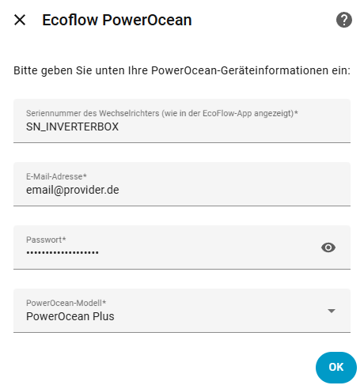
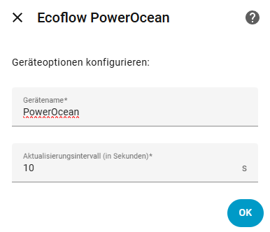
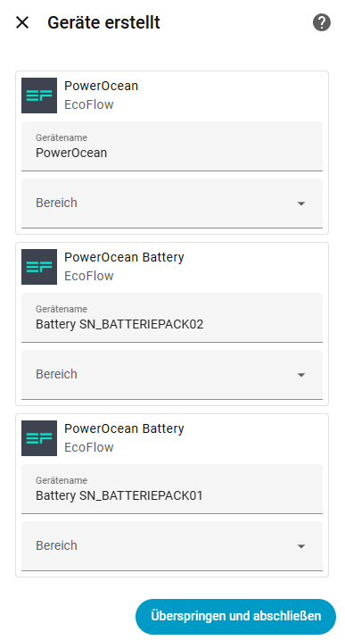
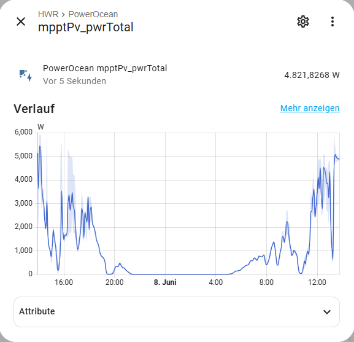
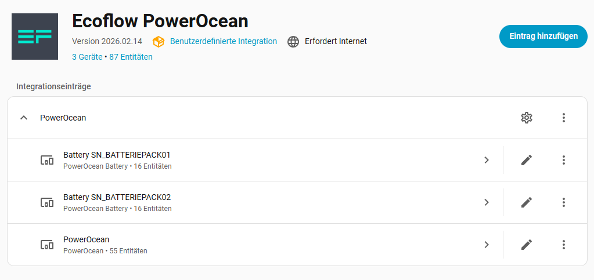
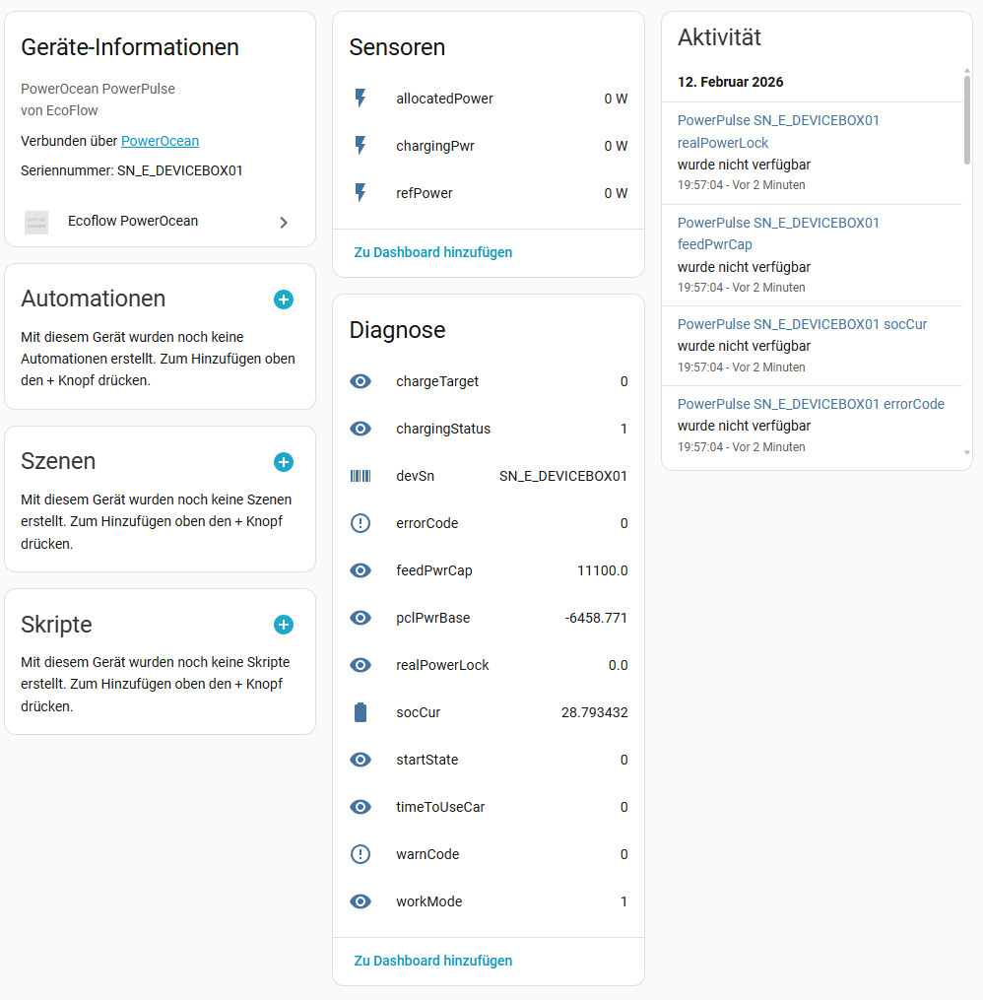
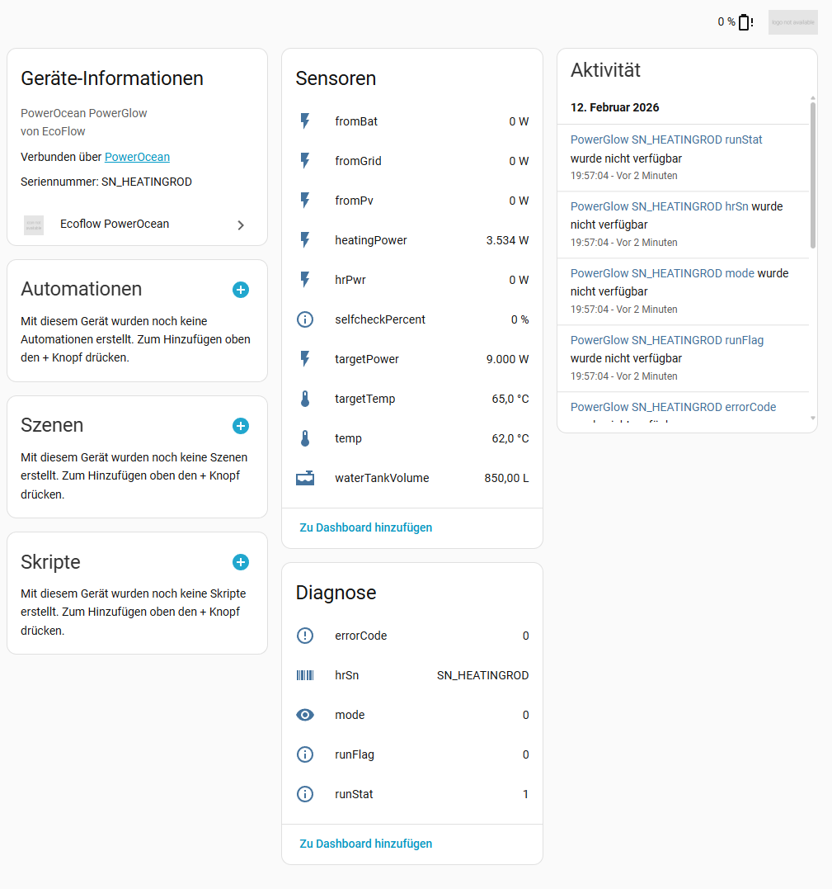
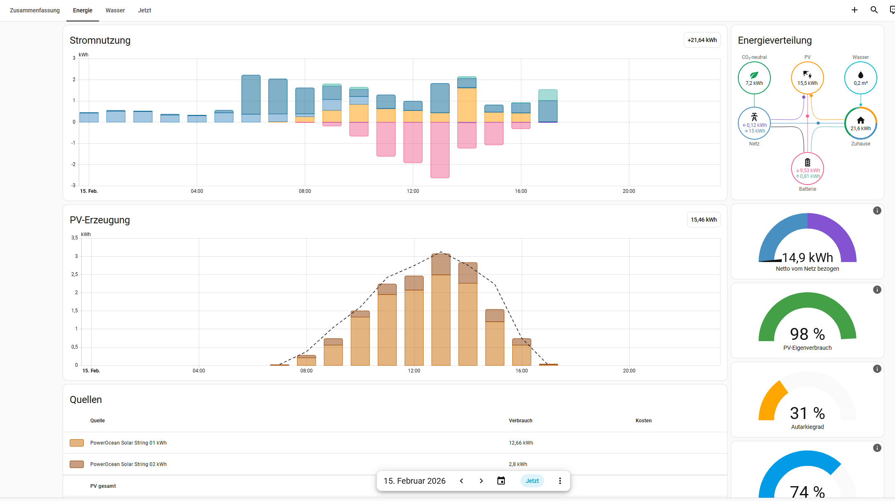

<!-- prettier-ignore -->
# Ecoflow PowerOcean
[](https://github.com/niltrip/powerocean/releases/)
[](https://github.com/niltrip/powerocean/issues)
[](https://github.com/niltrip/powerocean)
[](https://github.com/niltrip/powerocean/commits/main)
[](https://github.com/hacs/integration)
[](https://github.com/niltrip/powerocean/actions?query=workflow:"Validate")


[Home Assistant](https://home-assistant.io/) custom component to get access to my EcoFlow PowerOcean system.

This component was inspired by [tolwi/hassio-ecoflow-cloud](https://github.com/tolwi/hassio-ecoflow-cloud) and is a copy of [evercape/hass-resol-KM2](https://github.com/evercape/hass-resol-KM2).

## Disclaimers

⚠️ Temporary quick solution to my problem ("Nothing is more persistent than a makeshift solution.").
I hope of an integrate PowerOcean into [tolwi/hassio-ecoflow-cloud](https://github.com/tolwi/hassio-ecoflow-cloud) with an official API.

Nevertheless, I hope that it works for others as well.

## Prerequisites

I have tested the component with my System.
I use the Android App and the Webportal at https://portal.ecoflow.com/user/eu/de/login

You need the S/N number of your inverter and your credentinals

## Installation

- Install as a custom repository via HACS
- Manually download and extract to the custom_components directory

Once installed, use Add Integration -> Ecoflow PowerOcean.

## Configuration

Follow the flow.






### Sensors
Sensors are registered to device as `sensor.{device_name}_{sensor_name}` with an friendly name of `sensor_name`.
Additional attributes are presented on each sensor:
- Product Description, Destination Name, Source Name: internal names
- Internal Unique ID: `{serial}_{sensor_name}` or `{serial}_{report}_{sensor_name}`
- Device Name: `{serial}`
- Vendor Product Serial: serial number of the PowerOcean inverter
- Vendor Firmware Version: 5.1.27
- Vendor Product Build: 28

The versions are from my system.

### Which values update, and which do not

The EcoFlow cloud does not refresh all values at the same rate. Some of them keep returning the same number for hours. The integration reports what the API hands it, so a flat line here is not a bug in this component.

Measured on my own system over 72 hours (three-phase PowerOcean, one battery, release 2026.03.04):

| sensor | report | distinct values in 72 h |
|---|---|---|
| `mpptPwr`, `bpPwr` | `data` | 1 (always 0 W) |
| `pv1Pwr`, `pv2Pwr`, `pvInvPwr` | `ENERGY_STREAM_REPORT` | 1 (always 0 W) |
| `sysGridPwr`, `sysLoadPwr` | `data` | 4 |
| `todayElectricityGeneration` | `data` | about one per hour |
| `pcsMeterPower`, `pcsActPwr`, `mpptPv_pwrTotal` | `EMS_HEARTBEAT` | more than 2100 |

On 2026-08-21 at 13:16 `mpptPwr` read 0 W while `mpptPv_pwrTotal` read 4238 W. Both describe the same solar power, and both came out of the same response.

Others report in [#34](https://github.com/niltrip/powerocean/issues/34) and [#28](https://github.com/niltrip/powerocean/issues/28) that these values start moving again while the app or the web portal is open. I cannot confirm that part myself.

For a dashboard, take the values from `EMS_HEARTBEAT`:

- grid: `pcsMeterPower` (positive = import, negative = export) rather than `sysGridPwr`
- solar: `mpptPv_pwrTotal` rather than `mpptPwr`, `pv1Pwr` or `pvInvPwr`
- battery: `emsBpPower` rather than `bpPwr`
- house: `housePower`, which is calculated from the three values above

### Neuer Sensor (berechnet aus einzelnen Strings)



### Darstellung einzelner Geräte über SN





### Energiedashboard



## Troubleshooting
Please set your logging for the this custom component to debug during initial setup phase. If everything works well, you are safe to remove the debug logging:

```yaml
logger:
  default: warn
  logs:
    custom_components.powerocean: debug
```

## Credits

Thanks to my kollege David for giving me a start point.

And also thanks for the great work of the team from homeassistant and the great community.